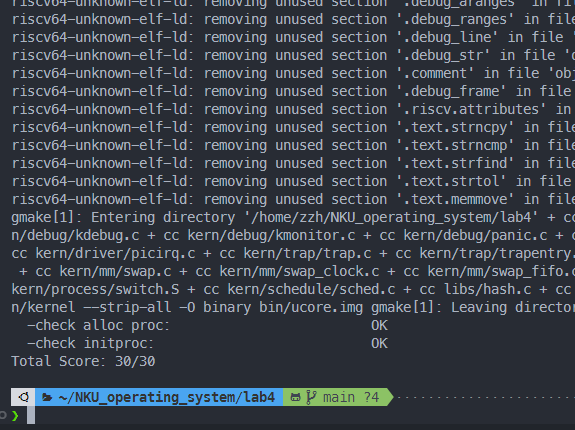

<h1>窦楷然 2210652&nbsp;&nbsp;&nbsp;&nbsp;&nbsp;屈华晨 2210650&nbsp;&nbsp;&nbsp;&nbsp;&nbsp;张梓恒 2211279</h1>
## 练习1：分配并初始化一个进程控制块

#### 问题1：请说明 `proc_struct` 中 `struct context context` 和 `struct trapframe *tf` 成员变量的含义及其在本实验中的作用。

这两个结构体在进程管理和上下文切换中起着重要作用。

1. **`struct context context`：**
   
    - **含义：** `context` 结构体用于保存进程的 CPU 上下文，包括通用寄存器（如 `ra`, `sp`, `gp` 等）的值。它主要用于在进程切换时保存当前进程的执行状态，以便稍后可以恢复该状态继续执行。
      
    - **作用：** 在本实验中，`context` 成员用于实现上下文切换。当调度器决定切换到另一个进程时，当前进程的 `context` 会被保存，而目标进程的 `context` 会被恢复，从而实现进程之间的切换。`switch_to` 函数会直接通过保存目标进程上下文的寄存器，来恢复 `context` 。
    
2. **`struct trapframe *tf`：**
   
    - **含义：** `trapframe` 结构体用于保存进程在陷入（如中断、异常或系统调用）时的 CPU 状态，包括程序计数器 (`epc`)、状态寄存器 (`status`)、以及所有通用寄存器的值等。
      
    - **作用：** 在本实验中，`tf` 成员用于处理中断和系统调用。当一个进程发生陷入时，当前的 `trapframe` 会被保存，以便在中断处理完成后能够正确恢复进程的执行状态。具体来说，`forkret` 函数会通过 `forkrets(current->tf)` 来处理新进程的陷入，并确保新进程能够从正确的位置继续执行。
      

两者都是用于保存CPU状态的结构体，但它们服务于不同的目的和场景。context 主要用于进程间的上下文切换，而 trapframe 则是在发生中断、异常或系统调用（即陷入）时使用，它保存了更完整的CPU状态，确保在处理完中断或系统调用后可以准确地恢复到陷入前的进程执行点。context 关注的是进程调度时的轻量级状态保存与恢复，而 trapframe 则是为了响应和处理各种类型的陷入事件提供完整且详细的CPU状态快照。

## 练习2：为新创建的内核线程分配资源

#### 问题：请说明 ucore 是否做到给每个新 fork 的线程一个唯一的 ID？请说明你的分析和理由。

在 `do_fork` 函数中，新进程的 PID 是通过调用 `get_pid()` 函数获取的。`get_pid()` 函数的实现逻辑如下：

1. **PID 分配机制：**
   
    - `get_pid()` 使用一个全局变量 `last_pid` 来记录上一次分配的 PID。
      
    - 每次分配 PID 时，`last_pid` 会递增，并检查新的 PID 是否已经被使用。
      
    - 如果 `last_pid` 达到 `MAX_PID`，则重置为 1，确保 PID 在有效范围内循环分配。
    
2. **哈希表管理：**
   
    - 新进程被添加到基于 PID 的哈希表中 (`hash_proc(proc)`)，加速 PID 的查找。
      

##### `do_fork` 函数详解

1. **静态变量：**
   
    - **`static int next_safe = MAX_PID;`**
      
        - **作用：** 记录下一个“安全”的 PID 上限，即当前可以分配 PID 的最大值。
        
    - **`static int last_pid = MAX_PID;`**
      
        - **作用：** 记录上一次分配的 PID，作为下一个 PID 分配的起点。next_safe与last_pid之间为可以使用的pid
    
2. **PID 递增与边界检查：**
   
    if (++ last_pid >= MAX_PID) {  
        last_pid = 1;  
        goto inside;  
    }
    
    - **解释：**
      
        - `last_pid` 自增，准备分配下一个 PID。`last_pid` 达到或超过 `MAX_PID`，则重置为 `1`，并跳转到 `inside` 标签，开始从头查找可用 PID。
    
3. **检查 `last_pid` 是否超出当前安全范围：**
   
    if (last_pid >= next_safe) {  
    inside:  
        next_safe = MAX_PID;
    
    - **解释：**
      
        - 如果当前的 `last_pid` 已经超出了 `next_safe`，则需要重新扫描所有进程以确保 PID 的唯一性。将 `next_safe` 重置为 `MAX_PID`，表示初始情况下，所有 PID 都是安全的。
    
4. **遍历进程列表以查找可用 PID：**
   
    - **解释：**
      
    - 从进程列表头部开始遍历，每次获取下一个进程 `proc`。
      
        - **PID 冲突检查：**
          
            - **if 语句**
              
                - 如果当前进程的 PID 与 `last_pid` 冲突，说明该 PID 已被占用。然后将 `last_pid` 自增，尝试下一个 PID。如果 `last_pid` 超过 `next_safe`，则检查是否需要重置 `last_pid` 并重新遍历。
                
            - **else if 语句**
              
                - 如果当前进程的 PID 大于 `last_pid`，且小于当前的 `next_safe`，则更新 `next_safe` 为该进程的 PID。这意味着在当前扫描过程中，找到了一个更小的可用 PID 上限，从而优化下次 PID 分配的效率。
                  

通过上述机制，ucore 能够确保每个新 fork 的线程都分配到一个唯一的 PID，避免 PID 冲突，保证系统中每个进程的唯一标识。

## 练习3: 编写 `proc_run` 函数

#### 问题：在本实验的执行过程中，创建且运行了几个内核线程？

**答案：**

在本实验的执行过程中，共创建并运行了 **两个** 内核线程：

1. **`idleproc`（PID = 0）：**
   
    - **创建过程：** 在 `proc_init()` 函数中通过 `alloc_proc()` 创建
    - **特点：**
        - 是系统创建的第一个内核线程
        - 作为空闲进程，仅在没有其他进程可运行时才会执行
        - 具有特殊的堆栈位置（`bootstack`）
        - 初始化时被设置为 `need_resched = 1` 
    
2. **`initproc`（PID = 1）：**
   
    - **创建过程：** 通过 `kernel_thread(init_main, "Hello world!!", 0)` 创建
    - **特点：**
        - 是系统创建的第二个内核线程
        - 执行 `init_main` 函数，输出初始化信息
        - 通过 `find_proc` 函数获取并命名为 "init"
        

**代码验证：**
从 `proc_init()` 函数实现可以看到：

```c
void proc_init(void) {
    // 创建 idleproc
    idleproc = alloc_proc();
    idleproc->pid = 0;
    idleproc->state = PROC_RUNNABLE;
    idleproc->kstack = (uintptr_t)bootstack;
    idleproc->need_resched = 1;
    set_proc_name(idleproc, "idle");
    
    // 创建 initproc
    int pid = kernel_thread(init_main, "Hello world!!", 0);
    initproc = find_proc(pid);
    set_proc_name(initproc, "init");
}
```


## 扩展练习 Challenge：中断处理机制

#### 问题：说明语句 `local_intr_save(intr_flag);` 和 `local_intr_restore(intr_flag);` 是如何实现开关中断的？

**答案：**

这两个操作通过宏定义和底层函数实现了精确的中断控制。根据 `lab4/kern/sync/sync.h` 的实现：

1. **中断的保存 `local_intr_save`：**
```c
#define local_intr_save(x)    \
    do {                      \
        x = __intr_save();    \
    } while (0)
```

其中 `__intr_save()` 的实现：
```c
static inline bool __intr_save(void) {
    if (read_csr(sstatus) & SSTATUS_SIE) {
        intr_disable();
        return 1;
    }
    return 0;
}
```

2. **中断的恢复 `local_intr_restore`：**
```c
#define local_intr_restore(x) __intr_restore(x);

static inline void __intr_restore(bool flag) {
    if (flag) {
        intr_enable();
    }
}
```

**工作原理：**

1. **中断保存过程：**
   - 读取 RISC-V 的 `sstatus` 寄存器，检查中断使能位（`SSTATUS_SIE`）
   - 如果中断当前是使能的，则：
     - 调用 `intr_disable()` 禁用中断
     - 返回 1 表示之前中断是开启的
   - 如果中断当前是禁用的，则返回 0

2. **中断恢复过程：**
   - 根据保存的 flag 值决定是否恢复中断
   - 如果 flag 为 1（表示之前中断是开启的），则调用 `intr_enable()` 重新使能中断

**使用示例：**
在 `proc_run()` 函数中的应用：
```c
void proc_run(struct proc_struct *proc) {
    if (proc != current) {
        bool intr_flag;
        struct proc_struct *prev = current;
        local_intr_save(intr_flag);    // 禁用中断
        {
            current = proc;
            lcr3(proc->cr3);
            switch_to(&(prev->context), &(proc->context));
        }
        local_intr_restore(intr_flag);  // 恢复中断
    }
}
```

这种机制确保了关键操作（如进程切换）的原子性，防止中断导致的竞态条件。

#### 附上运行截图

