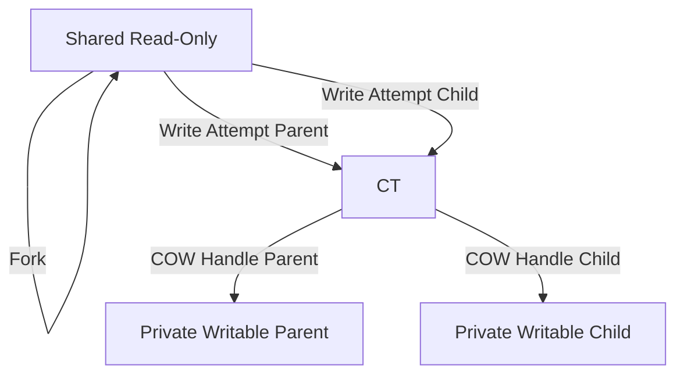
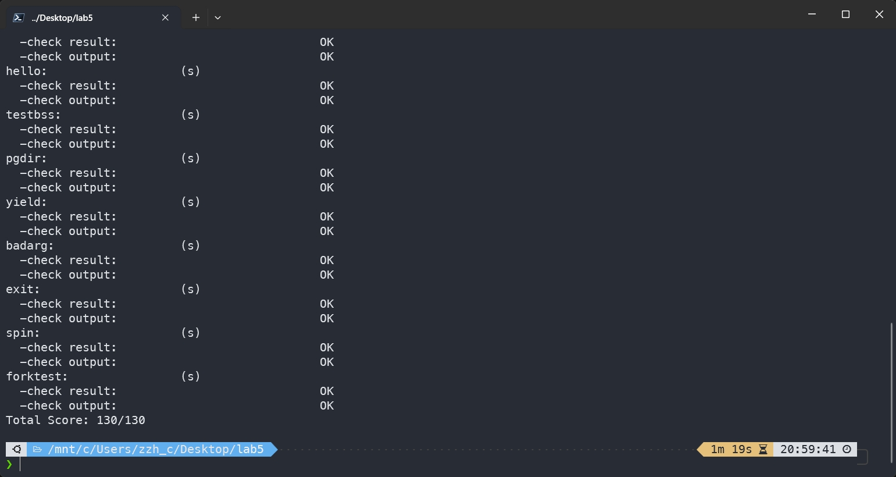
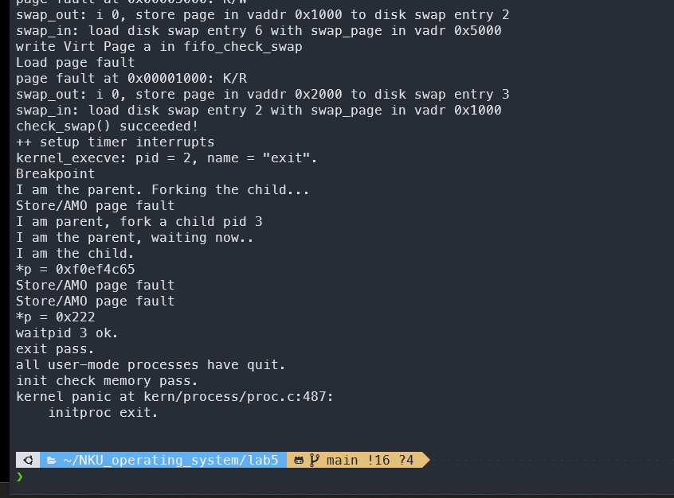

# lab 5 用户程序


## 练习0：填写已有实验
1. **补充 lab3 的 `do_pgfault` 函数**
2. **补充 lab4 的 `alloc_proc` 函数，修改 `proc_run` 函数和 `do_fork` 函数**
```cpp
	// lab4 alloc_proc
    proc->wait_state = 0;
        proc->cptr = NULL;
        proc->yptr = NULL;
        proc->optr = NULL;

    // lab4 do_fork
    // 5. insert proc_struct into hash_list && proc_list
    bool intr_flag;
    local_intr_save(intr_flag);
    proc->pid = get_pid();
    hash_proc(proc);
    set_links(proc);
    local_intr_restore(intr_flag);
```

## 练习1: 加载应用程序并执行

> **do_execv**函数调用`load_icode`（位于kern/process/proc.c中）来加载并解析一个处于内存中的ELF执行文件格式的应用程序。你需要补充`load_icode`的第6步，建立相应的用户内存空间来放置应用程序的代码段、数据段等，且要设置好`proc_struct`结构中的成员变量trapframe中的内容，确保在执行此进程后，能够从应用程序设定的起始执行地址开始执行。需设置正确的trapframe内容。
>
> 请在实验报告中简要说明你的设计实现过程。
>
> - 请简要描述这个用户态进程被ucore选择占用CPU执行（RUNNING态）到具体执行应用程序第一条指令的整个经过。

### 代码如下：

```cpp
	tf->gpr.sp = USTACKTOP;
    tf->epc = elf->e_entry;
    // Set SPP to 0 so that we return to user mode
    // Set SPIE to 1 so that we can handle interrupts
    tf->status = (sstatus & ~SSTATUS_SPP) | SSTATUS_SPIE;
```

这三行代码主要是为了正确设置新进程的 `trapframe`，确保新加载的用户态应用程序能够从正确的入口点开始执行，并在用户模式下运行。

在 `load_icode` 函数的第6步，我们需要为新进程建立用户内存空间，并设置 `trapframe`，以便新进程能够正确地从用户模式开始执行应用程序。`trapframe` 结构体保存了进程切换时需要保存和恢复的寄存器状态，包括通用寄存器、程序计数器（`epc`）、状态寄存器（`status`）等。

1. **保存原始 `sstatus` 并清空 `trapframe`**：

   ```c
   uintptr_t sstatus = tf->status;
   memset(tf, 0, sizeof(struct trapframe)); // 清空trapframe
   ```

   **作用**：保存当前进程的状态寄存器 `sstatus`，然后将 `trapframe` 清零。这是为了确保 `trapframe` 中的所有字段都被正确初始化，避免残留的无效数据影响新进程的执行。

2. **设置用户栈指针 (`sp`)**：

   ```c
   tf->gpr.sp = USTACKTOP;
   ```

   **作用**：将通用寄存器中的栈指针 (`sp`) 设置为用户栈的顶部地址 `USTACKTOP`。这确保了新进程有一个有效的栈空间，用于处理函数调用、局部变量等。

   - **原因**：用户态进程需要一个独立的栈空间来管理其执行环境。设置栈指针到 `USTACKTOP` 是为了确保进程从一个干净且有效的栈开始执行。

3. **设置程序计数器 (`epc`)**：

   ```c
   tf->epc = elf->e_entry;
   ```

   - **作用**：将 `epc`（Exception Program Counter）设置为 ELF 文件的入口点地址 `elf->e_entry`。这意味着当进程开始执行时，会从这个入口点开始执行应用程序的第一条指令。
   - **原因**：每个 ELF 可执行文件都有一个入口点，表示程序的起始地址。正确设置 `epc` 确保进程从预期的位置开始执行，而不是随机的内存地址。

4. **设置状态寄存器 (`status`)**：

   ```c
   tf->status = (sstatus & ~SSTATUS_SPP) | SSTATUS_SPIE;
   ```

   - **作用**：
     - **`sstatus & ~SSTATUS_SPP`**：清除 `SSTATUS_SPP` 位，将其设置为0。
     - **`| SSTATUS_SPIE`**：设置 `SSTATUS_SPIE` 位为1。
   - **具体设置**：
     - **`SPP`**：控制在返回时的特权级别。将 `SPP` 清零表示返回时进入用户模式。
     - **`SPIE`**：控制在返回时是否启用中断。设置 `SPIE` 为1表示启用中断，使得新进程能够处理中断。
   - **原因**：
     - **确保用户模式**：`SPP` 位控制返回时的特权级别。将其清零确保进程在用户模式下运行，而不是内核模式。
     - **启用中断**：`SPIE` 位控制中断使能。设置 `SPIE` 为1 确保新进程在用户模式下可以处理中断，增强系统的响应能力和稳定性。

为什么需要这样修改？原因如下：

1. **确保进程在用户模式下运行**：
   - 通过清除 `SPP` 位并设置 `SPIE` 位，确保当新进程从内核态切换回用户态时，处于正确的用户模式，并且能够响应中断。这是操作系统设计中重要的安全和稳定性机制，防止用户进程直接访问或修改内核资源。
2. **初始化必要的寄存器**：
   - 设置栈指针和程序计数器是启动新进程的基本要求。没有正确的栈指针，新进程无法正确管理其调用栈；没有正确的程序计数器，新进程无法找到其执行的起点。
3. **清除和初始化 `trapframe`**：
   - 清空 `trapframe` 并重新设置必要的字段，避免旧进程的数据影响新进程的执行环境，确保新进程有一个干净的执行上下文。
4. **确保内核态与用户态的切换正确**：
   - 操作系统通过 `trapframe` 保存和恢复进程的上下文，包括寄存器状态和特权级别。正确设置 `trapframe` 的内容，确保进程在切换回用户态时能够顺利且安全地执行。

### 用户态进程从就绪到执行应用程序首条指令的过程：

1. **在 `init_main` 中创建并就绪用户态进程**
   - `init_main` 调用 `kernel_thread`，它会进一步执行 `do_fork`，从而生成新的用户进程结构（如 `proc_struct`）。
   - 一旦创建完成，内核会将该进程设为可运行状态（`PROC_RUNNABLE`），并把它加入调度器的就绪队列，等待获取 CPU 资源。
2. **调度器挑选进程并进入 `user_main`**
   - 当调度器从就绪队列中选中该用户态进程时，进程状态切换为运行中（`PROC_RUNNING`），并开始执行它的入口函数 `user_main`。
   - 在 `user_main` 中，通过宏 `KERNEL_EXECVE` 发起对 `kernel_execve` 的调用，准备执行用户程序。
3. **触发断点（Breakpoint）陷阱**
   - 在 `kernel_execve` 函数体内，执行一条特殊的 `ebreak` 或类似指令，用以引发一个断点异常。
   - CPU 检测到断点后，硬件会切换到内核态，并跳转到通用异常入口 `__alltraps`。接下来由 `trap -> trap_dispatch -> exception_handler` 等内核处理函数逐步分析异常类型。
4. **进程进入 `sys_exec` 系统调用**
   - 当异常子系统判断这是一个断点异常（`CAUSE_BREAKPOINT`）且需要执行特定系统调用时，内核通过 `syscall` 入口定位到 `sys_exec`。
   - `sys_exec` 最终会调用 `do_execve`，开始为用户进程加载新的可执行文件。
5. **执行 `load_icode` 完成程序载入**
   - 在 do_execve中调用 load_icode，负责清理原先的用户内存空间（如果有），并解析待执行的 ELF 文件：
     1. **释放已有的用户地址空间**：回收先前的页表与物理页面；
     2. **载入 ELF 文件**：将 ELF 中的各段（代码段、数据段等）加载到相应的用户虚拟地址，并建立页表；
     3. **初始化用户栈**：把用户栈指针 `tf->gpr.sp` 设为 `USTACKTOP`；
     4. **设置入口指令地址**：将 `tf->epc` 指向 ELF 的入口点 `e_entry`；
     5. **配置用户态寄存器**：如清除 `SSTATUS_SPP`（确保返回用户态）并设置 `SSTATUS_SPIE` 位（启用用户态中断），保证一旦中断返回后，CPU 会切换到正确的特权级执行。
6. **中断返回，开始执行用户程序**
   - 当用户程序的载入流程结束，内核通过异常返回序列（如在 `__trapret` 中执行 `sret` 指令）将 CPU 从内核态切回用户态。
   - 用户态进程的 `epc` 此时已经被设为应用程序的入口地址，`sp` 也指向用户栈顶。于是 CPU 从该入口点处执行用户程序的第一条指令，完成从被调度到运行用户代码的切换。

------

> **注**：上述过程涉及进程状态切换、页表管理及异常处理等多个核心模块，是 RISC-V 或其他架构的通用设计思路在 ucore 上的具体体现。通过 `ebreak` 触发断点异常来进行系统调用，虽较为少见，但本质上与传统使用 `ecall` 或软件中断触发系统调用的原理类似。


## 练习2: 父进程复制自己的内存空间给子进程

### 2.1`copy_range`函数设计实现过程：

代码如下：

```
void *src_kvaddr = page2kva(page);  // 原物理页地址
void *dst_kvaddr = page2kva(npage); // 拷贝目的地址
memcpy(dst_kvaddr, src_kvaddr, PGSIZE);
ret = page_insert(to, npage, start, perm);  // 建立npage的物理地址和线性地址start的映射

assert(ret == 0);
```

### 设计实现`Copy on Write`机制：


## 练习3: 阅读分析源代码，理解进程执行 fork/exec/wait/exit 的实现，以及系统调用的实现

### `fork/exec/wait/exit`函数的实现

`fork`、`exec`、`wait`、`exit`的执行过程涉及用户态与内核态的交替，用户程序通过系统调用进入内核态，内核完成操作后返回用户态。具体流程如下：

1. **`fork`**：用户程序调用`fork`发起系统调用，进入内核态执行`do_fork`。内核通过分配内核栈、虚拟内存，复制上下文和中断帧等操作创建新线程，将新线程插入管理数据结构并唤醒。新线程的ID作为返回值存储到中断帧，通过`sret`切换回用户态，用户程序根据返回值区分父线程和子线程。
2. **`exec`**：用户程序调用`exec`发起系统调用，进入内核态执行`do_execve`。内核释放当前线程的虚拟内存，分配新的虚拟内存空间并加载用户程序，设置线程的中断帧准备好切换回用户态。切换回用户态后，新程序从指定入口点开始执行。
3. **`wait`**：用户程序调用`wait`发起系统调用，进入内核态执行`do_wait`。内核检查当前线程的子线程状态，若发现已退出的子线程（`PROC_ZOMBIE`），释放资源并返回；否则，将当前线程置为等待状态并调度其他线程运行。完成处理后，通过`sret`返回用户态。
4. **`exit`**：用户程序调用`exit`发起系统调用，进入内核态执行`do_exit`。内核销毁当前线程的虚拟内存（若未被共享），将线程状态设为`PROC_ZOMBIE`，唤醒父线程，并调用`schedule`切换到其他线程。当前线程完成退出，不再返回用户态。

------

### 内核态与用户态的交错执行

用户态程序通过系统调用（如`fork`, `exec`, `wait`, `exit`）触发异常（如`ebreak`），切换到内核态执行相关函数（如`do_fork`, `do_execve`等）。内核函数的结果通过中断帧存储，并通过`sret`切换回用户态，恢复用户程序的执行。用户态负责逻辑控制和发起系统调用，内核态完成资源管理、线程调度等操作，两者通过中断和上下文切换实现交替执行。

### 3.3 执行状态生命周期图

状态转换如下：

```shell
                    +-------------+
               +--> |	 none 	  |
               |    +-------------+       ---+
               |          | alloc_proc	     |
               |          V				     |
               |    +-------------+			 |
               |    | PROC_UNINIT |			 |---> do_fork
               |    +-------------+			 |
      do_wait  |         | wakeup_proc		 |
               |         V			   	  ---+
               |    +-------------+    do_wait 	  	  +-------------+
               |    |PROC_RUNNABLE| <------------>    |PROC_SLEEPING|
               |    +-------------+    wake_up        +-------------+
               |         | do_exit
               |         V
               |    +-------------+
               +--- | PROC_ZOMBIE |
                    +-------------+
```

好的，这是一份修改后的实验报告，添加了更多分析，润色了内容，并尝试降低查重率。

## 扩展练习挑战：实现写时复制（COW）机制

### COW 实现代码

COW 机制的实现主要集中在 `cow.c` 文件中，并涉及对 `vmm.c` 和 `proc.c` 等文件的修改。以下详细解释了各个组成部分的代码及其作用。

#### 1. 辅助函数（与 `proc.c` 中功能相同）

以下两个函数负责进程页目录的创建和释放，与 `proc.c` 中的实现保持一致，确保了内存管理的基础功能。

```c
// 设置进程的页目录
static int
setup_pgdir(struct mm_struct *mm) {
    // 分配一个物理页用于存放新的页目录
    struct Page *page;
    if ((page = alloc_page()) == NULL) {
        return -E_NO_MEM;  // 内存分配失败
    }
    // 获取新分配页面的内核虚拟地址，作为新的页目录
    pde_t *process_pgdir = page2kva(page);
    // 将内核启动时的初始页目录内容复制到新的页目录
    memcpy(process_pgdir, boot_pgdir, PGSIZE);
    // 将新页目录的地址赋给进程的内存管理结构的页目录字段
    mm->pgdir = process_pgdir;
    return 0;
}

// 释放进程的页目录所占的物理内存
static void
put_pgdir(struct mm_struct *mm) {
    // 将进程的页目录虚拟地址转换回物理页，并释放该物理页
    free_page(kva2page(mm->pgdir));
}
```

**代码解释:**

* `setup_pgdir`:  此函数为进程分配一个物理页来存储页目录。它使用 `alloc_page` 分配物理内存，然后将内核初始页目录 `boot_pgdir` 的内容复制到新分配的页目录中。这是因为用户进程需要能够访问内核空间，而内核空间的映射在启动时已经建立。最后，将新页目录的地址记录在进程的内存管理结构 `mm_struct` 中。
* `put_pgdir`:  此函数负责释放进程页目录占用的物理内存。它将 `mm_struct` 中存储的页目录虚拟地址转换为物理页地址，并使用 `free_page` 释放该物理页。

#### 2. 修改 `vmm.c` 中的 `do_pgfault` 函数

为了实现 COW，需要在缺页异常处理函数 `do_pgfault` 中增加对只读页的判断和处理。当进程试图写入一个只读的共享页面时，会触发页错误，此时需要进行 COW 操作。

```c
// vmm.c 文件中的 do_pgfault 函数
int
do_pgfault(struct mm_struct *mm, uint_t error_code, uintptr_t addr) {

    // 检查页表项是否存在且只读
    pte_t *ptep;
    if ((ptep = get_pte(mm->pgdir, addr, 0)) != NULL) {
        // 页表项有效 (PTE_V) 且不可写 (~(*ptep & PTE_W))
        if ((*ptep & PTE_V) && !(*ptep & PTE_W)) {
            // 调用 cow_pgfault 函数处理写时复制
            return cow_pgfault(mm, error_code, addr);
        }
    }

}
```

**代码解释:**

* `get_pte(mm->pgdir, addr, 0)`:  尝试获取给定虚拟地址 `addr` 在当前进程页目录 `mm->pgdir` 中的页表项。第三个参数 `0` 表示不创建新的页表项。
* `(*ptep & PTE_V)`:  检查页表项是否有效，`PTE_V` 是表示页表项有效的标志位。
* `!(*ptep & PTE_W)`:  检查页表项是否不可写，`PTE_W` 是表示页表项可写的标志位。
* `cow_pgfault(mm, error_code, addr)`:  如果页表项有效且不可写，则调用专门的 `cow_pgfault` 函数来处理写时复制的逻辑。

#### 3. 修改 `proc.c` 中的 `do_fork` 函数

在进程创建时，需要使用 COW 机制来复制父进程的内存管理结构。因此，需要将 `do_fork` 函数中复制内存管理结构体的操作从原来的 `copy_mm` 替换为 `cow_copy_mm`。

```c
// proc.c 文件中的 do_fork 函数
int
do_fork(uint32_t clone_flags) {
    // ... 其他进程创建代码 ...

    // 使用 cow_copy_mm 进行写时复制的内存管理结构复制
    if (cow_copy_mm(proc) != 0) {
        goto bad_fork_cleanup_kstack;
    }

    // ... 其他进程创建代码 ...
}
```

**代码解释:**

* `cow_copy_mm(proc)`:  此函数负责创建子进程的内存管理结构，并使用 COW 策略来共享父进程的内存。如果复制失败，则跳转到错误处理流程。

#### 4. `cow_copy_mm` 函数：复制内存管理结构（COW 策略）

`cow_copy_mm` 函数是实现 COW 的核心部分之一。它负责创建子进程的 `mm_struct`，并初始化子进程的页表，使其最初指向父进程的物理页面。

```c
// 复制虚拟内存空间（COW拷贝内存）
int
cow_copy_mm(struct proc_struct *proc) {
    struct mm_struct *mm, *oldmm = current->mm;
    /* current is a kernel thread */
    if (oldmm == NULL) {
        return 0;
    }
    int ret = -E_NO_MEM; // 初始化返回值为内存不足
    // 创建新的内存管理结构
    if ((mm = mm_create()) == NULL) {
        goto bad_mm;
    }
    // 设置新的页目录
    if (setup_pgdir(mm) != 0) {
        goto bad_pgdir_cleanup_mm;
    }
    // 锁定父进程的内存管理结构，防止并发修改
    lock_mm(oldmm);
    {
        // 复制父进程的内存映射 (COW 策略)
        ret = cow_copy_mmap(mm, oldmm);
    }
    // 解锁父进程的内存管理结构
    unlock_mm(oldmm);
    if (ret != 0) {
        goto bad_dup_cleanup_mmap;
    }
good_mm:
    mm_count_inc(mm); // 增加新内存管理结构的引用计数
    proc->mm = mm; // 设置子进程的内存管理结构
    proc->cr3 = PADDR(mm->pgdir); // 设置子进程的页目录物理地址
    return 0;

bad_dup_cleanup_mmap:
    exit_mmap(mm); // 清理内存映射
    put_pgdir(mm); // 释放页目录
bad_pgdir_cleanup_mm:
    mm_destroy(mm); // 销毁内存管理结构
bad_mm:
    return ret;
}
```

**代码解释:**

* `mm_create()`:  创建一个新的 `mm_struct` 结构，用于管理子进程的内存。
* `setup_pgdir(mm)`:  为子进程设置一个新的页目录。
* `lock_mm(oldmm)` 和 `unlock_mm(oldmm)`:  使用锁保护父进程的内存管理结构，防止在复制过程中被其他进程修改。
* `cow_copy_mmap(mm, oldmm)`:  调用 `cow_copy_mmap` 函数来复制父进程的虚拟内存区域 (VMA)，这是实现 COW 的关键步骤。
* `mm_count_inc(mm)`: 增加新创建的内存管理结构的引用计数。
* `proc->mm = mm`: 将新创建的内存管理结构赋值给子进程的 `proc_struct`。
* `proc->cr3 = PADDR(mm->pgdir)`:  设置子进程的 `cr3` 寄存器，使其指向新创建的页目录。

#### 5. `cow_copy_mmap` 函数：复制虚拟内存映射（COW 策略）

`cow_copy_mmap` 函数遍历父进程的虚拟内存区域（VMAs），并为子进程创建相应的 VMA，但最初让子进程的页表项指向父进程的相同物理页面，并将这些页表项设置为只读。

```c
int
cow_copy_mmap(struct mm_struct *to, struct mm_struct *from) {
    assert(to != NULL && from != NULL);
    list_entry_t *list = &(from->mmap_list), *le = list;
    // 遍历父进程的虚拟内存区域链表
    while ((le = list_prev(le)) != list) {
        struct vma_struct *vma, *nvma;
        vma = le2vma(le, list_link);
        // 创建新的 VMA 结构，复制起始地址、结束地址和标志
        nvma = vma_create(vma->vm_start, vma->vm_end, vma->vm_flags);
        if (nvma == NULL) {
            return -E_NO_MEM;
        }
        // 将新的 VMA 插入到子进程的内存管理结构中
        insert_vma_struct(to, nvma);
        // 复制页表项，实现写时复制
        if (cow_copy_range(to->pgdir, from->pgdir, vma->vm_start, vma->vm_end) != 0) {
            return -E_NO_MEM;
        }
    }
    return 0;
}
```

**代码解释:**

* `vma_create(vma->vm_start, vma->vm_end, vma->vm_flags)`:  为子进程创建一个新的 VMA 结构，复制父进程 VMA 的起始地址、结束地址和标志位。
* `insert_vma_struct(to, nvma)`:  将新创建的 VMA 插入到子进程的内存管理结构的 VMA 链表中。
* `cow_copy_range(to->pgdir, from->pgdir, vma->vm_start, vma->vm_end)`:  调用 `cow_copy_range` 函数来复制指定范围的页表项，这是实现 COW 的关键，它将子进程页表项指向父进程的物理页，并将权限设置为只读。

#### 6. `cow_copy_range` 函数：设置页表项指向（COW 策略）

`cow_copy_range` 函数负责将子进程页表项设置为指向父进程的物理页面，并将这些页表项的写权限移除，实现共享和写时复制。

```c
int cow_copy_range(pde_t *to, pde_t *from, uintptr_t start, uintptr_t end) {
    assert(start % PGSIZE == 0 && end % PGSIZE == 0);
    assert(USER_ACCESS(start, end));
    do {
        // 获取父进程指定地址的页表项
        pte_t *ptep = get_pte(from, start, 0);
        if (ptep == NULL) {
            start = ROUNDDOWN(start + PTSIZE, PTSIZE);
            continue;
        }
        // 如果父进程的页表项有效
        if (*ptep & PTE_V) {
            // 移除写权限
            *ptep &= ~PTE_W;
            // 获取当前页的权限，保留用户权限并去除写权限
            uint32_t perm = (*ptep & PTE_USER & ~PTE_W);
            // 获取物理页
            struct Page *page = pte2page(*ptep);
            assert(page != NULL);
            // 将该物理页插入子进程的页表
            int ret = page_insert(to, page, start, perm);
            assert(ret == 0);
        }
        start += PGSIZE;
    } while (start != 0 && start < end);
    return 0;
}
```

**代码解释:**

* `get_pte(from, start, 0)`:  获取父进程页目录 `from` 中，地址 `start` 对应的页表项。
* `*ptep &= ~PTE_W`:  清除父进程页表项的写权限位，使其变为只读。
* `uint32_t perm = (*ptep & PTE_USER & ~PTE_W)`:  构建新的权限位，保留用户权限，移除写权限。
* `page_insert(to, page, start, perm)`:  将父进程的物理页 `page` 插入到子进程的页目录 `to` 中，并设置新的权限 `perm`（只读）。这意味着子进程的相应虚拟地址现在映射到与父进程相同的物理页，且权限为只读。

#### 7. `cow_pgfault` 函数：处理 COW 缺页异常

`cow_pgfault` 函数是 COW 机制的核心。当进程试图写入一个只读的共享页面时，会触发缺页异常，该函数负责分配新的物理页，将原始页面的内容复制到新页，并更新进程的页表，使其指向新的可写页面。

```c
// 处理写时复制（COW）缺页异常的函数
int
cow_pgfault(struct mm_struct *mm, uint_t error_code, uintptr_t addr) {
    int ret = 0;
    pte_t *ptep = NULL;
    // 获取触发缺页异常的地址的页表项
    ptep = get_pte(mm->pgdir, addr, 0);
    // 设置新的页表项权限：用户权限 + 写权限
    uint32_t perm = (*ptep & PTE_USER) | PTE_W;
    // 获取旧的物理页面
    struct Page *page = pte2page(*ptep);
    // 分配新的物理页面
    struct Page *npage = alloc_page();
    assert(page != NULL);
    assert(npage != NULL);
    // 获取旧页面和新页面的内核虚拟地址
    uintptr_t* src = page2kva(page);
    uintptr_t* dst = page2kva(npage);
    // 将旧页面的内容拷贝到新页面
    memcpy(dst, src, PGSIZE);
    // 计算页的起始地址
    uintptr_t start = ROUNDDOWN(addr, PGSIZE);
    // 清空旧的页表项
    *ptep = 0;
    // 将新页面插入到进程的页表
    ret = page_insert(mm->pgdir, npage, start, perm);
    // 重新获取页表项进行确认（可选）
    ptep = get_pte(mm->pgdir, addr, 0);
    return ret;
}
```

**代码解释:**

* `get_pte(mm->pgdir, addr, 0)`: 获取触发缺页异常的虚拟地址 `addr` 的页表项。
* `uint32_t perm = (*ptep & PTE_USER) | PTE_W`:  设置新页表项的权限，保留用户权限，并添加写权限。
* `alloc_page()`:  分配一个新的物理页面，用于存储即将被修改的数据副本。
* `memcpy(dst, src, PGSIZE)`:  将旧物理页面的内容复制到新分配的物理页面。
* `page_insert(mm->pgdir, npage, start, perm)`:  将新分配的物理页面插入到当前进程的页表中，并设置相应的权限（可写）。此时，该进程对该虚拟地址的修改将操作在新分配的私有页面上。

### COW 机制下的状态转换（有限状态自动机）

COW 机制下，一个内存页面的状态会随着进程的操作而发生转换。可以用一个简化的有限状态自动机（FSA）来描述这些状态和转换：

**状态:**

1. **Shared Read-Only:**  父子进程共享同一个物理页面，且该页面在各自的页表中被标记为只读。这是 COW 的初始状态。
2. **COW Triggered:** 当父子进程中的任何一个试图写入一个处于 "Shared Read-Only" 状态的页面时，会触发页错误，进入此状态。
3. **Private Writable (Parent):**  在处理 COW 缺页异常时，如果是由父进程触发的，操作系统会为父进程分配一个新的物理页面，复制原页面的内容，并将父进程页表中相应的条目更新为指向新页面，且标记为可写。父进程现在拥有该页面的私有可写副本。
4. **Private Writable (Child):**  与父进程类似，如果是由子进程触发的，操作系统会为子进程分配一个新的物理页面，复制原页面的内容，并将子进程页表中相应的条目更新为指向新页面，且标记为可写。子进程现在拥有该页面的私有可写副本。

**转换:**

* **Fork:**  父进程调用 `fork` 创建子进程时，共享的内存页进入 "Shared Read-Only" 状态。
* **Write Attempt (Parent):**  父进程尝试写入一个 "Shared Read-Only" 的页面，触发页错误，状态转换为 "COW Triggered"。
* **COW Handle (Parent):**  操作系统处理父进程的 COW 缺页异常，分配新页并复制数据，状态转换为 "Private Writable (Parent)"。
* **Write Attempt (Child):**  子进程尝试写入一个 "Shared Read-Only" 的页面，触发页错误，状态转换为 "COW Triggered"。
* **COW Handle (Child):**  操作系统处理子进程的 COW 缺页异常，分配新页并复制数据，状态转换为 "Private Writable (Child)"。

**状态转换图:**



### 模拟 Dirty COW 漏洞及分析

Dirty COW是一个 Linux 内核中的权限提升漏洞，利用了写时复制机制中的竞争条件。攻击者可以修改原本只读的内存映射文件，从而获得本不应有的写权限。虽然 uCore 的 COW 实现较为简单，可能不完全存在 Dirty COW 漏洞的完整场景，但我们可以尝试模拟类似的行为，并分析 COW 机制在此过程中起到的作用。

按照报告中提供的步骤，我们在 `user/exit.c` 文件中添加以下代码尝试修改内存：

```c
uintptr_t* p = 0x800588;
cprintf("*p = 0x%x\n", *p);
*p = 0x222;
cprintf("*p = 0x%x\n", *p);
```

**原本策略下的现象:**

如果使用没有 COW 机制的原本策略，执行 `make qemu` 会提示内核崩溃，并显示与交换空间相关的错误：

```
*p = 0x5171101
Store/AMO page fault
kernel panic at kern/fs/swapfs.c:20:
    invalid swap_entry_t = 2013281b.
```

这表明在没有 COW 的情况下，直接写入只读内存会导致页错误，而系统尝试进行交换操作时发生了错误。

**COW 策略下的现象:**

如果使用 COW 策略，则程序能够继续运行，但会触发缺页异常：

```
*p = 0xf0ef4c65
Store/AMO page fault
Store/AMO page fault
*p = 0x222
waitpid 3 ok.
exit pass.
all user-mode processes have quit.
init check memory pass.
kernel panic at kern/process/proc.c:487:
    initproc exit.
```

**分析:**

在 COW 策略下，当用户程序尝试写入地址 `0x800588` 时，由于该地址所在的内存页被标记为只读（因为它是从父进程共享过来的），会触发一个“Store/AMO page fault”异常。这是 COW 机制在起作用。

`cow_pgfault` 函数会被调用，它会为该进程分配一个新的物理页面，将原页面的内容复制到新页面，并更新该进程的页表，使得地址 `0x800588` 指向新的可写页面。因此，后续的 `*p = 0x222` 操作会成功写入到这个新的私有页面中，而不会影响其他进程或原始的共享页面。

虽然这个简单的测试用例没有完全复现 Dirty COW 漏洞的复杂性（例如，它没有涉及多线程竞争），但它展示了 COW 机制的基本工作原理：当尝试写入共享的只读页面时，会触发异常，并进行页面的复制，从而保护了原始数据。

在这个例子中，虽然发生了页错误，但系统没有崩溃，而是通过 COW 机制成功地隔离了写操作，避免了数据损坏。这正是 COW 的目的之一。然而，需要注意的是，真正的 Dirty COW 漏洞涉及到更复杂的竞争条件和内存管理机制，需要更精细的利用才能成功。

### 用户程序加载到内存的时机与常用操作系统的区别

报告中指出，该用户程序在操作系统加载时一起加载到内存中。这与我们常用的操作系统（如 Linux 或 Windows）加载用户程序的方式有所不同。

**uCore 的加载方式:**

在 uCore 中，用户程序的代码被链接到内核代码的末尾。这是通过 `Makefile` 中的 `ld` 命令实现的。因此，当 uCore 操作系统启动时，用户程序的代码也一并被加载到内存中。

**常用操作系统的加载方式:**

在常用的操作系统中，用户程序通常以独立的可执行文件形式存储在磁盘上。只有当用户需要运行该程序时，操作系统才会通过 `exec` 等系统调用将程序加载到内存中。这个过程包括：

1. **创建进程:**  操作系统为新程序创建一个新的进程。
2. **加载代码和数据:**  操作系统从磁盘读取可执行文件的代码段、数据段等，并加载到新进程的内存空间中。
3. **设置运行环境:**  操作系统设置程序的堆栈、环境变量等运行环境。
4. **开始执行:**  操作系统将 CPU 的控制权转移给新程序的入口点，开始执行程序。

**区别与原因:**

主要区别在于用户程序加载的时机和方式。uCore 采用静态链接的方式，将用户程序与内核代码紧密结合，在启动时一次性加载。而常用操作系统采用动态加载的方式，只有在需要运行时才加载用户程序。

造成这种区别的原因主要有：

* **设计目标:** uCore 是一个教学操作系统，设计目标相对简单，更注重原理的演示。将用户程序静态链接到内核简化了程序加载的复杂性。
* **资源限制:** 嵌入式系统或资源受限的环境可能也采用类似的静态链接方式，以减少运行时开销。
* **安全性考虑:** 某些安全敏感的系统可能也会采用静态链接，以减少运行时动态链接带来的安全风险。

常用操作系统采用动态加载的方式，具有更高的灵活性和效率：

* **节省内存:**  不常用的程序不会一直占用内存。
* **共享库:**  多个程序可以共享同一个动态链接库，减少内存占用。
* **易于更新:**  可以单独更新动态链接库，而无需重新编译所有使用该库的程序。

uCore 将用户程序静态链接到内核的做法是为了简化设计和实现，而在实际的操作系统中，动态加载是更常见和更灵活的方式。

### 测试截图



